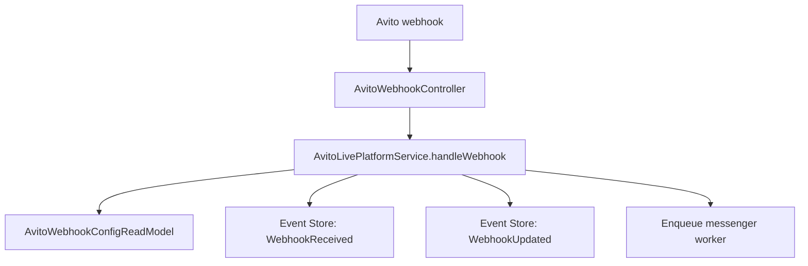

# Webhook Center

Ingress: `POST /api/webhooks/avito?tenantId=&accountId=` (public, no JWT)

UI: `/avito/live` → **Webhooks** tab  
API: `GET /api/avito/live/webhooks?accountId=`

## Flow

## Webhook URL

Generated per account:

`{API_URL}/api/webhooks/avito?tenantId={uuid}&accountId={uuid}`

Register this URL in Avito developer settings for messenger events.

## History

Last 50 events stored in `AvitoWebhookConfigReadModel.history`.

## Test

`POST /api/avito/live/webhooks/test?accountId=` — synthetic `test.ping` event for pipeline verification.

## Signature

Avito signature header captured in logs. Full verification depends on Avito app secret configuration (plugin adapter stub returns permissive in dev).
